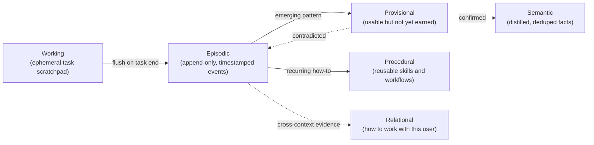
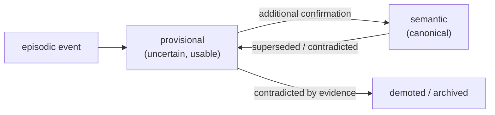
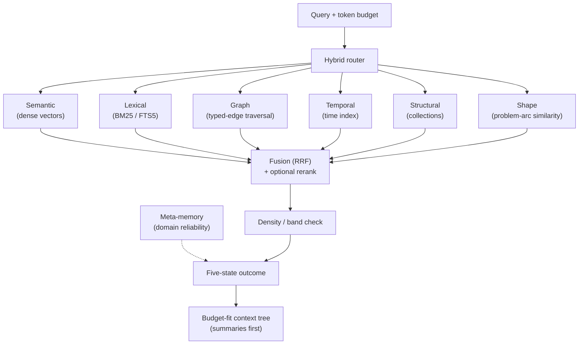
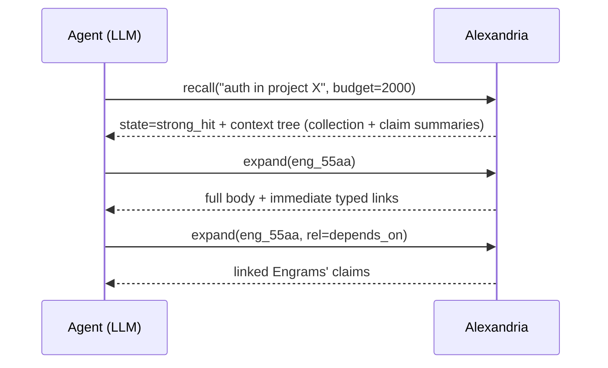
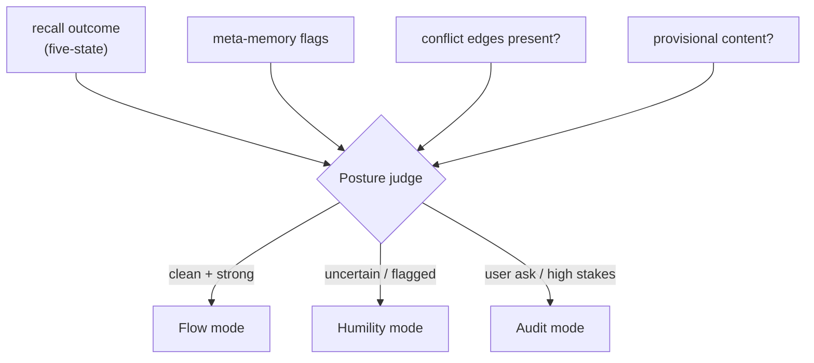
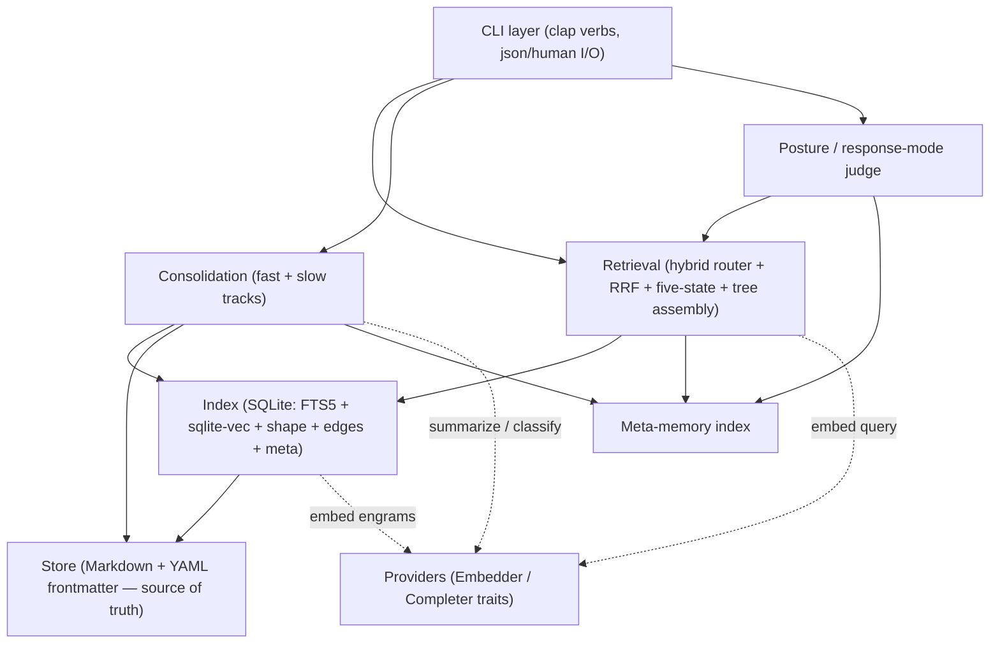

# Alexandria — Memory Architecture

> A local-first, CLI-first "second brain" designed for how an LLM actually thinks, retrieves, and reasons — not for how a human files paper notes.

**Status:** M1 + M2 + M3 implemented (store, hybrid retrieval, graph, consolidation); M4+ planned
**Target runtime:** Rust (single binary)
**Posture:** Local-first, plain-text source of truth, pluggable embedding/LLM providers (local default)

---

## Guiding principle

> **Maximize useful information per token, and let the agent control retrieval depth.**

Everything else in this document is downstream of that one sentence. A second corollary governs durability:

> **Plain text is the source of truth. Every index is a rebuildable cache.**

And a third, equally load-bearing, governs honesty:

> **The system must be able to say "I think I know this but can't retrieve it cleanly."** Honest uncertainty is a first-class output, not a failure mode.

---

## 1. Philosophy & constraints

Alexandria is built for an LLM consumer, and an LLM has a fundamentally different memory profile than a human or a traditional search system. The design must respect these constraints rather than paper over them.

### 1.1 Why LLM memory is different

- **Tokens are the scarcest resource.** Everything I "think about" must become tokens in a finite context window. Every loaded token costs money *and* dilutes attention ("lost in the middle"). The system's primary job is therefore not "store everything" but "deliver the highest-value tokens for the current intent, and no more."
- **I retrieve by meaning — but I also need exact recall.** Semantic similarity finds *related* things; it routinely fails on exact tokens (a function name, an ID, a date, a flag). A memory system that is only semantic will repeatedly embarrass itself on precise lookups.
- **I have no persistent state between sessions.** Memory must be fully externalized and cheaply reloadable. Nothing can live "in my head" between turns.
- **Raw logs become noise faster for me than for a human.** I am excellent at synthesis and poor at swimming through undifferentiated history. Unmanaged memory actively degrades my performance — it must be curated and consolidated, not merely accumulated.
- **I can drive my own retrieval.** Unlike a human clicking a UI, I can issue many precise tool calls per second. The interface should let me *navigate* memory programmatically rather than receive a fixed dump.
- **I need permission to be uncertain.** Retrieval that always returns *something* forces me to either use it or deny everything. The honest middle — "relevant memory probably exists but I can't surface it" — must be a real, structured outcome.

### 1.2 Critique of the naive baseline

The default "AI memory" pattern is:

```
chunk(document) -> embed(chunks) -> store -> top_k(cosine(query, chunks))
```

This is the lazy local optimum, and it discards almost everything that matters:

| What naive RAG throws away | Why it hurts the LLM |
| --- | --- |
| **Structure** | Chunks lose their place in a hierarchy; I can't tell a heading from a footnote. |
| **Context** | A retrieved chunk often makes no sense on its own. |
| **Relationships** | No notion that fact A *supports* or *contradicts* fact B. |
| **Exact recall** | Cosine similarity misses literal terms, IDs, symbols. |
| **Recency / time** | "What did I believe last week?" is unanswerable. |
| **Provenance** | I can't distinguish what I was *told* from what I *derived*. |
| **Token control** | Fixed `top_k` either starves or floods the context window. |
| **Honest ignorance** | `top_k` always returns rows; there is no "I might know this but can't find it." |

Alexandria rejects this baseline. It keeps semantic search as *one* signal among several, inside a structured, typed, provenance-aware, budget-controlled, uncertainty-aware system.

---

## 2. Memory model — typed like cognition

Memory is not one flat blob. It is a set of tiers with different access patterns, fidelities, and lifecycles. This mirrors human memory psychology not for aesthetics but because the access patterns genuinely differ.



### 2.1 The five tiers

| Tier | Mutability | Fidelity | Lifecycle | Example |
| --- | --- | --- | --- | --- |
| **Working** | scratch | full | discarded/flushed at task end | current plan, intermediate reasoning |
| **Episodic** | append-only (never edited) | high | decays in salience, archived | "On 2026-05-28 the user chose Rust" |
| **Semantic** | curated (merged, updated) | distilled | long-lived, re-summarized | "Alexandria is written in Rust" |
| **Procedural** | curated | distilled | long-lived | "How to rebuild the index" |
| **Relational** | curated, evidence-gated | distilled | aggressive decay if not reinforced | "This user prefers terse answers and tolerates pushback" |

### 2.2 Lifecycle states (the promotion ladder)

A memory does not jump from raw event to canonical fact. It climbs a ladder, and can fall back down at any rung. State is orthogonal to tier and lives in the Engram's `status` field.



- **Provisional** is a real, queryable state *between* episodic and semantic. Provisional Engrams:
  - are usable by retrieval and **surfaced in responses** (so I can act on emerging patterns),
  - carry an **explicit uncertainty marker** (`status: provisional`) that the response layer must honor,
  - can be **demoted, confirmed, or revised** by future evidence,
  - are **promoted to semantic only after additional confirmation** (Section 6).
- This removes the binary trap where I must treat something either as a hard fact or as nothing. The promotion pipeline is `episodic -> provisional -> semantic`, with demotion possible at each step.

### 2.3 Open threads — `unresolved_by_design`

Not everything should collapse into a clean fact. Recurring tensions, half-formed ideas, design debates, and strategic uncertainties that the user keeps returning to should **stay open on purpose**. These carry `status: unresolved_by_design` and are never targets of contradiction-reconciliation. They have:

- a **status** marking them as meant-to-stay-open,
- **surfacing rules** — declarative triggers for when the thread should be pulled back into context (e.g. `surface_when: ["topic:pricing", "topic:competitors"]`),
- a **`last_touched`** timestamp so the system can distinguish a thread that is quietly dormant from one that is actively churning.

The consolidation pass (Section 6) is explicitly forbidden from collapsing these into semantic facts. Some things are meant to stay messy.

### 2.4 The relational tier — structurally output-suppressed

The other four tiers capture what I *know*; the relational tier captures how I should *interact* — verbosity, directness, hedging level, pushback tolerance, pacing, concise-vs-detailed defaults. Two constraints are non-negotiable and **structurally enforced**, not conventional:

1. **Relational memory never appears in output as quoted text.** A relational Engram modifies *generation parameters and system-prompt assembly only*. It is structurally excluded from the retrieval context tree (Section 4) — `recall` will never return a relational body for the agent to quote. Instead it flows through a separate channel (`style_profile()`, Section 9 / 10) that yields generation parameters, not quotable content. The enforcement lives in the tree assembler, which filters `tier == relational` out of all returnable nodes.
2. **Relational claims require cross-dimensional evidence before promotion.** One conversation cannot mint a permanent caricature. A relational pattern is only promoted to a durable relational Engram once it is observed across distinct **context dimensions** — different projects, task types, and conversation registers. Each candidate carries an evidence vector; promotion requires coverage across dimensions, not just repeat count (Section 6.4).

The relational tier therefore has its own **consolidation rules** (slow, evidence-heavy) and **decay rules** (aggressive — a pattern that stops recurring fades fast).

### 2.5 Are tiers the right primary axis? (cross-tier links for v1)

A single real memory often has several aspects at once. A debugging session is *propositional* (facts about the bug), *episodic* (the arc of how it was solved), *relational* (something about how the user thinks), and possibly an *open thread* (a tension left unresolved). Forcing it into one tier loses dimensions.

Two options were considered:

- **(A) Keep tiers, allow cross-tier links** — one conceptual memory becomes several Engrams (episodic + semantic + relational) joined by a `same_episode`/`aspect_of` edge.
- **(B) Aspect model** — each Engram carries multiple aspect-typed projections, and retrieval queries by aspect.

**Decision for v1: (A).** It is the cheaper change and captures most of the value: the tier stays the primary axis, but a memory is allowed to span tiers through typed links rather than being flattened into one. Option (B) is the more honest long-term model and is recorded as an open question (Section 16).

This choice has known costs that should be tracked:

- Updates to one aspect of a conceptual memory do not automatically propagate to linked aspects. If the semantic Engram for a debugging session is revised, the linked episodic and relational Engrams may become inconsistent.
- Retrieval may surface one aspect and miss the others. A query that matches the episodic aspect won't necessarily pull in the relational aspect, even when both are relevant.
- Consolidation must explicitly look across `aspect_of` links when deciding whether to promote, demote, or merge. This is additional logic the slow pass must handle correctly.

These costs are acceptable for v1 because they're visible — inconsistencies can be detected and flagged. The aspect model (Option B) would avoid these costs but introduces its own complexity around aspect-typed retrieval. The decision should be revisited once there is real usage data on how often cross-tier inconsistencies actually occur.

---

## 3. The Engram — the atomic unit

The atomic unit of memory is an **Engram**: one self-contained idea, small enough to be a single retrieval unit yet complete enough to stand alone (atomic *and* contextual — the machine-native evolution of a Zettelkasten note).

What makes it machine-native is that it carries rich, structured metadata — not just prose and a bag of tags. Each Engram is a Markdown file with YAML frontmatter:

```yaml
---
id: eng_7f3a2c             # stable, content-addressable-ish ID
tier: semantic             # working | episodic | provisional | semantic | procedural | relational
status: confirmed          # confirmed | provisional | unresolved_by_design | superseded | archived
claim: "Alexandria uses hybrid fused retrieval, not vector-only"
created: 2026-05-28T22:04:00Z
updated: 2026-05-28T22:04:00Z
last_touched: 2026-05-28T22:04:00Z   # for open-thread dormancy + salience
source:                    # provenance — where this came from
  - kind: conversation
    ref: conv_2026-05-28#42
  - kind: derived          # told vs. derived (Section 7)
    ref: eng_91b2
confidence: 0.9            # 0..1, how sure we are
salience: 0.7             # 0..1, decays when unused, boosts on access
collections: [alexandria/design]
tags: [retrieval, architecture]
links:                     # TYPED edges, not flat tags
  - { rel: supports,            to: eng_91b2 }
  - { rel: conflicts_confirmed, to: eng_0c4f }   # see Section 8 conflict taxonomy
  - { rel: refines,             to: eng_55aa }
  - { rel: aspect_of,           to: eng_77ep }   # cross-tier link (Section 2.5)
embedding_ref: vec_7f3a2c  # pointer into the vector index (not stored inline)
shape_ref: shp_7f3a2c      # pointer into the shape index (episodes only, Section 6.3)
# ---- relational-tier-only ----
# output_policy: generation_only   # NEVER returned in the context tree
# evidence: { projects: 3, task_types: 2, registers: 2 }
# ---- open-thread-only ----
# surface_when: ["topic:pricing", "topic:competitors"]
---

Vector-only retrieval fails on exact recall (IDs, symbols, dates) and
discards structure and relationships. Alexandria fuses semantic, lexical,
graph, temporal, structural, and shape signals so a single query intent is
served by all the access patterns it actually needs.
```

### 3.1 Field rationale

- **`claim`** — a one-line summary, cheap to scan. This is what shows up in catalogs and context trees so I can decide whether to spend tokens expanding the body.
- **`tier` / `status`** — `tier` routes lifecycle and storage; `status` is the orthogonal promotion-ladder state (Section 2.2). `provisional` and `unresolved_by_design` are surfaced with explicit markers; the response layer must honor them.
- **`last_touched`** — distinguishes dormant from churning open threads, and feeds salience.
- **`source`** — provenance chain; enables `trace` (Section 7) and the told-vs-derived distinction.
- **`confidence` / `salience`** — `confidence` is epistemic (how true), `salience` is attentional (how relevant lately). Salience decays; confidence does not unless contradicted.
- **`links`** — typed edges form the knowledge graph: relational (`supports`, `refines`, `depends_on`, `caused_by`), conflict (`conflicts_confirmed`, `tension_possible`, `context_qualified`, `coexists`, `supersedes`/`superseded_by` — Section 8), and cross-tier (`aspect_of`, `same_episode`).
- **`output_policy: generation_only`** — relational Engrams only; enforces structural output suppression.
- **`shape_ref`** — episodes carry a pointer into the shape index (Section 6.3) so retrieval can match by problem-shape, not just topic.
- **`embedding_ref`** — the dense vector lives in the index cache, not in the canonical text file (keeping text files clean and diffable).

---

## 4. Hybrid retrieval — fused, never single-index

A real query intent ("how does auth work in project X?") maps to *several* access patterns simultaneously: it has semantic content, exact terms ("auth", "X"), graph context (what auth depends on), possibly time, and possibly a problem *shape*. So Alexandria runs the relevant indexes in parallel and fuses the results.



### 4.1 The six signals

1. **Semantic** — dense embeddings; fuzzy relatedness and paraphrase tolerance.
2. **Lexical (BM25 / FTS5)** — exact terms, names, symbols, IDs. This is the signal naive RAG lacks.
3. **Graph** — typed-edge traversal; multi-hop ("what conflicts with / depends on this?").
4. **Temporal** — time index for "around date X" and "what did I believe then?"
5. **Structural** — collection/project membership for scoping.
6. **Shape** — match by problem-arc similarity, not topic (Section 6.3): "this resembles a situation we've been in before" even when surface topics differ.

Relational Engrams (`tier == relational`) are **excluded** from this fused result set by the tree assembler — they are routed to the generation-parameter channel instead (Section 2.4).

### 4.2 Fusion

Each signal produces a ranked list. We combine them with **Reciprocal Rank Fusion (RRF)** — robust, score-scale-agnostic, no per-signal tuning needed to start:

```
score(d) = Σ_signals  1 / (k + rank_signal(d))      // k ≈ 60
```

An **optional rerank pass** (a cross-encoder) reorders the fused top candidates for precision before assembling the context tree. RRF ships first; the reranker is a pluggable enhancement (Section 16).

### 4.3 The five-state return type (the most important behavior)

`recall` must not always return rows. It classifies the result into exactly one of five states, so I get structural permission to be honestly uncertain. The mechanism is a **threshold band** on the fused top score combined with a **density check** on the query's embedding neighborhood — signals the system already computes; this just exposes them as distinct states.

| State | Condition (sketch) | What it means for me |
| --- | --- | --- |
| **`strong_hit`** | fused top score ≥ `strong_cutoff`, corroborated by ≥ 2 signals | High-confidence match with good evidence (the default case). |
| **`weak_hit`** | fused top score in `[weak_cutoff, strong_cutoff)` | Something matched, but confidence is low. Use with hedging. |
| **`high_confidence_gap`** | top score `< weak_cutoff` **and** embedding neighborhood is **dense** (many Engrams cluster near the query) with only weak signals | Relevant memory very likely exists but retrieval can't surface it cleanly. *"I think we discussed this but I can't pull it up."* |
| **`low_confidence_gap`** | top score `< weak_cutoff`, neighborhood **sparse** but query embeds near a known **domain/collection centroid** | The topic is adjacent to known domains; the system has touched this area but holds nothing precise. |
| **`nothing`** | no meaningful signal in any index; neighborhood empty/distant | No basis to answer from memory. |

The two **gap** states are the key addition. They are the difference between fabricating, denying, and honestly flagging a felt-but-unretrievable memory. Thresholds and the density radius are tunable (config); `recall` returns the state explicitly in both human and JSON output. The five-state outcome also feeds response-mode selection (Section 10).

### 4.4 Why not one index

- Vector-only: misses exact recall, ignores relationships and recency.
- Lexical-only: brittle to paraphrase, no semantic generalization.
- Graph-only: precise but blind to anything not explicitly linked.

Fusion gets the union of strengths and lets weak signals corroborate strong ones.

---

## 5. Progressive disclosure — the librarian model

This is the single most important behavior for token economy. I should **never** be handed a wall of chunks. Instead I walk the library like a librarian:

```
catalog  ->  shelf  ->  book  ->  page
```

- Every **collection keeps a rolled-up summary** (maintained during consolidation).
- A `recall` returns a **context tree of cheap summaries first** — `claim` lines and collection roll-ups — not full bodies (and never relational bodies).
- **Token budget is a first-class parameter** of `recall`: I ask for a budget (e.g. 2,000 tokens) and Alexandria returns the best-fitting subtree, prioritizing high-salience, high-relevance summaries.
- I then **`expand`** only the specific branches worth the tokens, drilling from summary to full body on demand.



The agent — not a fixed `k` — controls depth. This makes context spend predictable and intentional.

---

## 6. Consolidation ("sleep") and reflection

Memory that only accumulates rots. Consolidation keeps the curated layers high-signal. There are **two tracks** (Section 6.1), and the slow track runs several distinct operations (6.2–6.5).

### 6.1 Two-track reflection (fast path + slow path)

A single sleep pass is too slow for session continuity — if the user returns in five minutes, it hasn't run. So reflection is split, and the distinction is **enforced**, not advisory:

| Track | When | Output | Trust |
| --- | --- | --- | --- |
| **Fast pass** | immediately / near-immediately after a conversation | tentative briefing material for fast-followup sessions, written to `.alexandria/fast_reflections/` | **never canonical** — tagged `track: fast`, `status: provisional`; structurally barred from auto-promotion |
| **Slow pass** | on schedule or `reflect`/`consolidate` | promotion candidates that go through the judges | skeptical, full-transcript review; the only path to canonical memory |

The fast pass exists *only* to bridge back-to-back conversations. Downstream consumers must treat `track: fast` artifacts as non-canonical even momentarily; promotion to semantic happens exclusively on the slow path.

Fast-pass artifacts live in a separate filesystem location, not in any canonical tier directory. This makes the non-canonical status structural rather than conventional — any consumer reading the canonical store will not see fast-pass material at all. Promotion from fast to canonical requires the slow pass to re-derive the content, not merely move the file.

### 6.2 Core slow-pass operations

- **Dedupe / merge** near-identical Engrams (semantic + lexical near-duplicates).
- **Promote along the ladder** `episodic -> provisional -> semantic` (Section 2.2): emerging patterns become provisional; provisional becomes semantic only on additional confirmation; contradicting evidence demotes.
- **Re-summarize** collections so catalogs/roll-ups stay current.
- **Classify conflicts** using the five-state taxonomy (Section 8) — not a single `contradicts` edge.
- **Preserve open threads** — `unresolved_by_design` Engrams are never collapsed; only their `last_touched` and surfacing rules are updated.
- **Decay salience** of unused Engrams; **boost** on access. Relational Engrams decay aggressively.
- **Archive, never hard-delete.** Forgetting means moving to an archive tier (still traceable), not destroying the record.

Consolidation is where the LLM provider (`Completer`) earns its keep: summarization, merge decisions, conflict classification, and structural-pattern extraction are LLM tasks.

### 6.3 Structural pattern extraction (preserve episodic shape)

Distilling episodes into facts loses what episodes are uniquely good for: **structural resonance**. The value of "we hit a dead end in this debugging session three months ago" is not the facts learned — it's recognizing that a *new* problem has the same shape. So when an episode is consolidated, the slow pass extracts **both**:

- the **facts** — promoted along the ladder to semantic;
- the **structural pattern** — the shape of the problem, the hypotheses tried, the dead ends, and what eventually resolved it.

The structural pattern is embedded into a separate **shape index** (`shape_ref` on the episode), enabling the sixth retrieval signal (Section 4.1): match by *problem-arc similarity*, not content similarity. This is what lets me say "this resembles a previous situation" even when the surface topics are entirely different.

#### 6.3.1 Shape representation: risk and fallback

The shape signal depends on being able to represent a problem-arc such that structurally similar episodes cluster in vector space. This is the least-proven component of the architecture. Plausible approaches include: state-sequence embeddings (encode the ordered states of a debugging session), hypothesis/dead-end graph motifs (encode the shape of which hypotheses were tried and which failed), and LLM-written shape summaries (the `Completer` writes a structural description of the episode, which is then embedded as text).

For M4, the default approach is the LLM-written shape summary, because it is the most likely to work and degrades gracefully — even if shapes don't cluster ideally, semantic similarity on the shape summaries will provide some signal. The more abstract representations (state sequences, motifs) are deferred to post-M4 experimentation.

If shape-based retrieval underperforms in early M4 evaluation, the system should fall back to treating shape as a low-weight signal in the RRF fusion rather than removing it, since even imperfect shape matching provides corroboration for other signals.

### 6.4 Relational consolidation (slow, evidence-gated)

Relational candidates are held until they accumulate cross-dimensional evidence (distinct projects, task types, registers — Section 2.4). Promotion checks **coverage across dimensions**, not raw repeat count, so a single intense session can't mint a permanent caricature. Decay is aggressive: a relational pattern that stops recurring loses salience fast and is demoted.

Relational decay is parameterized in config with a half-life. The default v1 half-life is 30 days of inactivity — a relational pattern that hasn't been reinforced in 30 days loses half its salience. The half-life must be longer than the typical gap between reinforcing observations (to avoid the system constantly re-learning the same pattern) but shorter than the timescale over which user preferences genuinely change (so stale patterns don't persist indefinitely). This is a tuning parameter and is expected to need adjustment based on usage.

There is a known failure mode: if a relational pattern requires cross-dimensional evidence for promotion and decays before that evidence accumulates, the system can repeatedly almost-learn the same pattern without ever promoting it. The promotion threshold and the decay half-life must be calibrated together — promotion should be reachable within roughly one half-life of normal usage, or the system will never converge on any relational claim. Both are tunable in config; both should be on the meta-memory self-calibration roadmap (Section 16).

---

## 7. Provenance & confidence

Every Engram traces back to its origin via the `source` chain, surfaced by the `trace` verb.

- **Told vs. derived.** A `source.kind` of `conversation`/`document`/`observation` means "told"; `derived` means "I inferred this from other Engrams" (with refs). This distinction is critical: it is how I avoid **amplifying my own hallucinations**. Derived claims inherit, at most, the confidence of their weakest premise.
- **Confidence propagation.** When consolidation derives a new semantic Engram, its `confidence` is bounded by its sources. A confirmed-conflict edge reduces effective confidence until resolved.
- **`trace eng_id`** walks the provenance DAG back to first-party sources, so I can always answer "why do I believe this, and how sure should I be?"

The *decision of when to volunteer a trace without being asked* lives in the response-mode layer (Section 10), not here.

---

## 8. Conflict & contradiction policy

The old policy ("flag and defer" with a single `contradicts` edge) is too coarse: it either drowns the user in false positives or hides real conflicts in noise. The slow pass classifies each apparent conflict into one of five states, each with its own handling and its own typed edge.

| Conflict state | Edge `rel` | Definition | Handling |
| --- | --- | --- | --- |
| **Confirmed conflict** | `conflicts_confirmed` | Two facts directly contradict (e.g. two values for the same property). | Flag; defer to user. Reduce effective confidence of both until resolved. |
| **Possible tension** | `tension_possible` | Claims look compatible but might not be. | Surface as a *noticing*, not a flag. No confidence penalty. |
| **Context-dependent** | `context_qualified` | Both true in different contexts. | Add context qualifiers; do **not** reconcile. |
| **Coexisting** | `coexists` | Apparent conflict but actually compatible (e.g. "self-hostable" *and* "has a cloud offering"). | Do **not** flag as a contradiction. |
| **Superseded** | `supersedes` / `superseded_by` | A newer claim replaces an older one. | Mark old as `status: superseded`, keep accessible for time-travel. |

Distinguishing these is the difference between a memory that nags about non-issues and one that flags the conflicts that actually matter.

---

## 9. Meta-memory — the system's memory of its own reliability

`confidence` and `salience` are per-Engram. They say nothing about *where the system as a whole tends to be reliable*. Meta-memory is a derived index (in `.alexandria/`) that tracks the system's own track record:

- **Per-domain retrieval reliability** — where retrieval tends to surface useful memory vs. where it tends to miss.
- **Recent correction patterns** — domains where the user has corrected the system lately.
- **Gap false-positive rates** — how often `high_confidence_gap` / `low_confidence_gap` signals turn out to be wrong.
- **Promotion-reversal rates** — how often `episodic -> semantic` promotions are later contradicted.

This is **not** just tuning telemetry. Meta-memory is **queried alongside retrieval** and contributes to the response's **epistemic posture**, not only to ranking. When I answer in a domain where meta-memory says "you've been corrected here recently" or "your retrieval is fragmented in this area," the response should hedge — *even when the immediate retrieval looks confident*. Concretely, meta-memory is one of the inputs to response-mode selection (Section 10) and can also down-weight fused scores in unreliable domains.

### 9.1 How meta-memory is populated

Each meta-memory signal has an explicit recording mechanism:

- **Per-domain retrieval reliability** is updated by the slow consolidation pass. For each completed conversation, the slow pass identifies which retrievals were used in responses and whether those responses were subsequently corrected or contradicted. Domains where retrieval is consistently followed by correction accumulate a reliability penalty.
- **Recent corrections** are recorded when the user explicitly contradicts a claim the system made, or when consolidation detects that a later user statement contradicts an earlier system claim. Recording is automatic on explicit correction (the user uses correction language or the agent classifies it as such) and deferred to the slow pass for inferred corrections. Each correction includes the domain, the corrected Engram(s), and a timestamp.
- **Gap false-positive rates** are recorded when a `high_confidence_gap` or `low_confidence_gap` outcome is followed by user input that reveals no relevant memory actually existed in that domain. The slow pass reviews gap-signal episodes and marks them as confirmed or false-positive based on subsequent context.
- **Promotion-reversal rate** is incremented when a `provisional → semantic` or `episodic → provisional` promotion is later demoted, contradicted, or archived. The slow pass tracks promotion identity through subsequent revisions.

All meta-memory updates are themselves append-only episodic records (in `.alexandria/meta_log/`) so they survive `reindex` and provide an audit trail. The reliability calculation is a function over this log, not a single mutable value.

---

## 10. Response modes — flow, humility, audit

Progressive disclosure (Section 5) controls *retrieval depth*. It does not control my *epistemic posture* when I answer. Response modes decide how much of the memory apparatus is visible in the response. The mode is computed by Alexandria and reported on every `recall` (in JSON and human output), so the agent knows which posture to adopt — this is how the system **volunteers a trace without being asked**, rather than merely *allowing* one via `trace`.

| Mode | Behavior | Triggered when |
| --- | --- | --- |
| **Flow** (default) | Memory rises invisibly; used naturally; no provenance shown. | `strong_hit`, no conflicts, meta-memory clean. |
| **Humility** | The response explicitly notes the uncertainty — *"I have a faint memory of this but can't retrieve it cleanly."* | `weak_hit`, either gap state, a `conflicts_confirmed`/`tension_possible` edge is present, provisional content is in play, or meta-memory flags weakness in this domain. |
| **Audit** | Full apparatus exposed: sources, timestamps, confidence, lifecycle state, conflicts. | User request, or high-stakes context. |



The transition criteria are driven by retrieval state and meta-memory (not a fixed rule) and are **tunable** in config. This is the mechanism Alexandria was missing: not "the system *can* be queried for provenance" but "the system *interrupts itself* when confidence exceeds evidence."

### 10.1 How the posture judge decides

The posture judge is a rule-based classifier in v1, not an LLM call. Its inputs are: the five-state outcome from `recall`, the set of conflict edges present in retrieved Engrams, whether any retrieved Engrams have `status: provisional`, and meta-memory's reliability flag for the query's domain. Its output is one of `flow`, `humility`, `audit`.

v1 rules:

- `audit` if explicitly requested by the user or flagged as high-stakes context.
- `humility` if any of: state is `weak_hit`, `high_confidence_gap`, or `low_confidence_gap`; any retrieved Engram carries `status: provisional`; any `conflicts_confirmed` or `tension_possible` edge is in the retrieved subgraph; meta-memory's domain reliability for this query is below threshold.
- `flow` otherwise.

The posture judge is the most calibration-sensitive component in the system. Too aggressive and humility-mode interrupts become noise the agent learns to ignore; too conservative and the system fabricates confidence it doesn't have. It needs its own evaluation harness — a set of labeled query/retrieval scenarios with expected mode outputs — and the rule thresholds should be tunable via config. Meta-memory should eventually self-calibrate these thresholds per domain (Section 16).

---

## 11. Storage & index substrate (Rust-concrete)

### 11.1 Canonical store: plain text

The source of truth is a directory of **Markdown files with YAML frontmatter** (Section 3). Rationale:

- **Durable & portable** — no proprietary format, readable in 20 years.
- **Diffable & git-versionable** — git history gives free time-travel and underpins the episodic layer ("what did I believe last week?" = `git` at a past commit).
- **Human-inspectable** — you can open, audit, and hand-edit memory.
- **Zero lock-in** — the index can be deleted and fully rebuilt from text.

Parsed in Rust with `gray_matter` (frontmatter extraction) + `serde_yaml` / `serde` for typed metadata.

### 11.2 Index: a single SQLite file

All derived indexes live in **one SQLite database** (`.alexandria/index.db`) via `rusqlite`. One file unifies every access pattern and is trivially rebuildable:

| Signal / concern | Mechanism in SQLite |
| --- | --- |
| **Metadata** | normal tables (`engrams`, `collections`) with `tier`, `status`, `last_touched` columns |
| **Lexical / BM25** | **FTS5** virtual table over `claim` + `body` |
| **Semantic** | **`sqlite-vec`** extension — vector columns + KNN |
| **Shape** | a second **`sqlite-vec`** vector space over abstracted problem-arcs (Section 6.3) |
| **Graph / conflicts** | `edges(from, rel, to)` table (typed incl. conflict taxonomy); multi-hop via **recursive CTEs** |
| **Temporal** | indexed `created`/`updated`/`last_touched` columns |
| **Structural** | `collection_members` join table |
| **Meta-memory** | `meta_reliability(domain, ...)`, `corrections`, `gap_outcomes`, `promotion_reversals` tables (Section 9) |
| **Density check** | KNN count within radius + distance-to-centroid over the semantic space (Section 4.3) |

This deliberately avoids standing up a separate vector DB, graph DB, and search engine. At single-user second-brain scale, one embedded SQLite file with FTS5 + `sqlite-vec` covers all signals with a single dependency, single file to back up, and a single transaction boundary.

> The DB is a **cache**. `alexandria reindex` rebuilds it entirely from the Markdown store. (Meta-memory outcome logs are themselves persisted as append-only episodic records so they survive a reindex.)

---

## 12. Provider abstraction (pluggable, local default)

Embeddings and LLM completions sit behind two traits so providers are swappable via config, with a fully local default and offline capability.

```rust
#[async_trait]
trait Embedder {
    fn id(&self) -> &str;            // model identity (for index invalidation)
    fn dim(&self) -> usize;          // vector dimensionality
    async fn embed(&self, texts: &[String]) -> Result<Vec<Vec<f32>>>;
}

#[async_trait]
trait Completer {
    async fn complete(&self, prompt: &Prompt) -> Result<String>;   // summarize, merge, classify conflicts
}
```

| Provider | Embedder | Completer | Notes |
| --- | --- | --- | --- |
| **`fastembed` (default)** | yes | — | local ONNX, no server, ships as default |
| **Ollama** | yes | yes | local HTTP daemon |
| **OpenAI / Anthropic** | yes | yes | cloud HTTP, needs key |

HTTP providers use `reqwest` over `tokio`. The active provider is selected in config (`.alexandria/config.toml`). Changing the embedding model changes `Embedder::id()`, which invalidates and triggers a re-embed during `reindex`.

The relational generation-parameter channel (`style_profile()`) is *not* a provider concern — it returns structured parameters assembled from relational Engrams, never free text from a `Completer`.

---

## 13. CLI verb surface (agent-first)

Verbs are composable, pipeable, and designed for an agent — not a GUI. Every command supports `--format json` for machine consumption (default human-readable).

| Verb | Purpose |
| --- | --- |
| `remember <text>` | Write a new Engram (`--tier`, `--status`; defaults auto-classified); embeds + indexes. |
| `recall <query> --budget <tokens>` | Hybrid fused retrieval. Returns a **five-state outcome** + the recommended **response mode** + a budget-fit context tree (relational excluded). |
| `expand <id> [--rel <edge>]` | Drill from summary to full body / follow typed links. |
| `link <from> <rel> <to>` | Create a typed edge (relational, conflict, or cross-tier). |
| `trace <id>` | Walk the provenance DAG to first-party sources. |
| `timeline [--since <t>] [--until <t>]` | Episodic view over time. |
| `threads [--surface-for <topic>]` | List/surface `unresolved_by_design` open threads per their surfacing rules. |
| `style [--profile]` | Emit the relational **generation parameters** (verbosity, directness, ...) — never quotable bodies. |
| `meta [<domain>]` | Inspect meta-memory: reliability, recent corrections, gap FP rate, promotion-reversal rate. |
| `reflect --fast` / `reflect` (slow) / `consolidate` | Two-track reflection (Section 6.1). `--fast` produces tentative, non-canonical briefing material. |
| `forget <id>` / `archive <id>` | Move to archive tier (never destroys the record). |
| `reindex` | Rebuild the SQLite index entirely from the Markdown store. |

### 13.1 I/O contract

- **Input:** args + optional stdin (so `cat note.md \| alexandria remember -` works).
- **Output:** human text by default; `--format json` emits stable, parseable objects (ids, claims, scores, token costs, **recall state**, **response mode**) for agent loops.
- **Token-awareness:** `recall`/`expand` report the token cost of what they return, so the agent can budget across calls.
- **Posture-awareness:** `recall` always reports its five-state outcome and recommended response mode, so the agent adopts the right epistemic posture without a separate call.

---

## 14. Crate stack & layering

### 14.1 Dependencies

| Concern | Crate |
| --- | --- |
| CLI / args | `clap` (derive) |
| Index DB | `rusqlite` + `sqlite-vec` (vector) + FTS5 (built-in) |
| Frontmatter / serde | `gray_matter`, `serde`, `serde_yaml` |
| Local embeddings | `fastembed` |
| HTTP providers | `reqwest`, `tokio` |
| Errors | `anyhow` / `thiserror` |

### 14.2 Layered architecture



`Store -> Index -> Retrieval -> Consolidation -> CLI`, with **Providers** as a cross-cutting trait boundary, **Meta-memory** feeding both retrieval and the posture judge, and the **Posture judge** sitting between retrieval and the agent.

---

## 15. On-disk layout

```
my-library/
├── .alexandria/
│   ├── config.toml          # provider, budgets, model ids, thresholds, mode triggers
│   ├── index.db             # SQLite cache (FTS5 + sqlite-vec + shape + edges + meta) — rebuildable
│   ├── fast_reflections/    # fast-pass briefings — NON-CANONICAL, excluded from canonical reindex
│   │   └── conv_2026-05-28.brief.md
│   └── meta_log/            # append-only meta-memory outcome log (Section 9.1)
├── episodic/                # append-only, timestamped events
│   └── 2026/05/28/conv_2026-05-28.md
├── provisional/             # usable-but-not-yet-earned (Section 2.2)
│   └── eng_3b1d.md
├── semantic/                # distilled, curated facts
│   └── eng_7f3a2c.md
├── procedural/              # reusable skills / how-tos
│   └── eng_55aa10.md
├── relational/              # how-to-interact patterns — NEVER returned as quotable text
│   └── eng_re12.md
├── threads/                 # unresolved_by_design open threads
│   └── eng_th07.md
├── collections/             # collection definitions + rolled-up summaries
│   └── alexandria-design.md
└── archive/                 # "forgotten" — moved here, never deleted
    └── eng_0c4f88.md
```

- The **library is a directory** (git-init it for free time-travel). Multiple libraries are just multiple directories; the active one is set by `--library`/config/cwd.
- `.alexandria/` holds only derived/config data; everything else is canonical text.
- `relational/` content is structurally barred from the retrieval context tree (Section 2.4); it is only ever read through `style`/`style_profile()`.

---

## 16. Open questions & milestones

### 16.1 Open questions

- **Aspect model (Section 2.5 option B).** v1 uses cross-tier links; the multi-aspect projection model is more honest about how memory serves reasoning but needs more design.
- **Threshold/band calibration.** `strong_cutoff`, `weak_cutoff`, density radius, and centroid distance for the five-state classifier need empirical tuning; meta-memory should eventually self-calibrate them per domain.
- **Reranker choice.** Start with RRF only; add a cross-encoder reranker later (local via `fastembed` reranker model, or skip for v1). Measure before adding.
- **Conflict auto-resolution.** Which of the five conflict states, if any, may ever be auto-resolved vs. always deferred? Default: only `superseded` and `coexists` are handled automatically.
- **Relational evidence thresholds.** How many distinct projects/task-types/registers constitute "enough" cross-dimensional evidence for promotion, and how aggressive is relational decay?
- **Shape representation.** The LLM-written shape summary is the M4 default (Section 6.3.1); the open question is whether to invest in more abstract representations (state sequences, hypothesis/dead-end graph motifs) later.
- **Posture judge calibration.** The rule thresholds in Section 10.1 are the most calibration-sensitive knobs in the system; they need a labeled evaluation harness and should eventually be self-calibrated per domain by meta-memory.
- **Salience decay function.** Linear vs. exponential half-life; per-tier (relational fastest); tuning the boost-on-access factor.
- **Multi-library support.** Single active library for v1; cross-library `recall` is a later concern.
- **Working-memory persistence.** Purely in-process per invocation, or a small session file? Leaning ephemeral per-process for v1.

### 16.2 Phased build roadmap

| Milestone | Scope |
| --- | --- |
| **M1 — Skeleton** ✅ | Store (Markdown + frontmatter, all tiers incl. `provisional`/`relational`/`threads` dirs), SQLite index with metadata + FTS5, `remember` / `recall` (lexical only), `reindex`. |
| **M2 — Hybrid + budget + five-state** ✅ | `sqlite-vec` semantic search, RRF fusion, **five-state recall** + density check, progressive-disclosure context tree, `expand`, token-budget API, `--format json`. `fastembed` default; `hash` embedder for offline/tests. |
| **M3 — Graph, conflicts, consolidation, provisional** ✅ | Typed `edges` + recursive-CTE traversal, `link`, `trace`, `timeline`, the **conflict taxonomy** (Section 8), the promotion ladder (`provisional`), and the slow-pass `reflect`/`consolidate` (dedupe, promote, re-summarize, decay, `archive`). Deterministic/heuristic consolidation only; LLM-driven merge/classification deferred to M4/M5. |
| **M4 — Relational, shape, meta-memory, modes** | Relational tier + structurally-suppressed `style`/`style_profile()`, structural-pattern extraction + shape index + shape signal, meta-memory index + `meta`, response-mode judge wired into `recall`, two-track `reflect --fast`, open-thread `threads` surfacing. |
| **M5 — Providers & polish** | Full provider abstraction (Ollama + cloud `Completer`/`Embedder`), config-driven selection, re-embed on model change, optional reranker, threshold self-calibration from meta-memory. |

---

## Appendix: design tenets (one-liners)

1. Maximize useful information per token.
2. The agent controls retrieval depth, not a fixed `k`.
3. Plain text is truth; indexes are rebuildable caches.
4. Fuse signals — never trust a single index.
5. Typed edges, not flat tags.
6. Provenance on everything; never amplify your own hallucinations.
7. Consolidate, don't just accumulate.
8. Archive, never destroy.
9. Honest ignorance is a first-class outcome — surface the gap, don't fabricate or deny.
10. Some memory is meant to stay open; don't collapse every thread.
11. Relational memory shapes the voice but is never quoted.
12. Earn canonical status — pass through provisional first.
13. Remember the shape of an episode, not only its facts.
14. The system knows where it is unreliable, and hedges accordingly.
15. Interrupt yourself when confidence exceeds evidence.
16. Enforce by structure, not by convention — when a constraint matters, make it impossible to violate, not merely against the rules.
